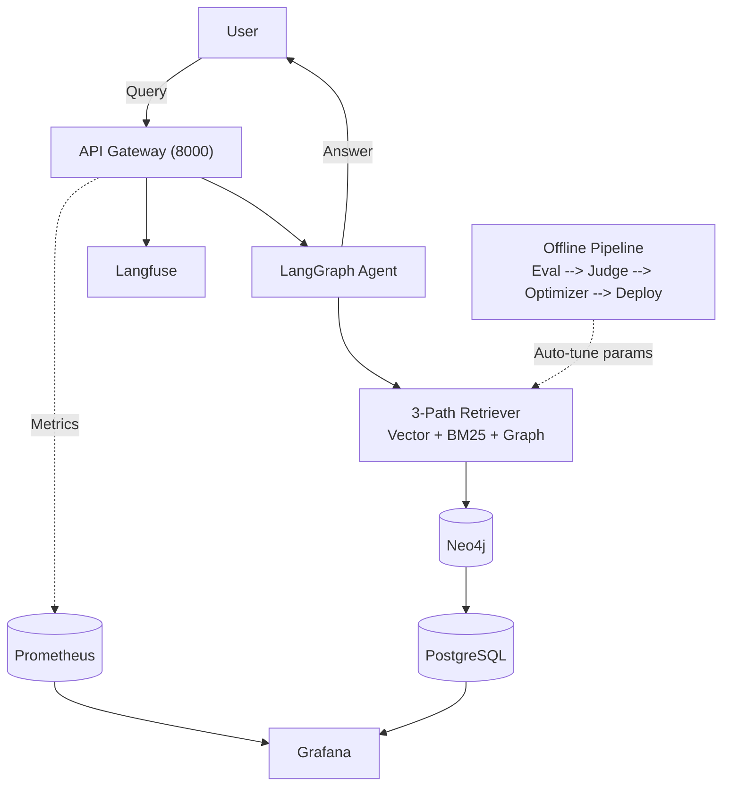
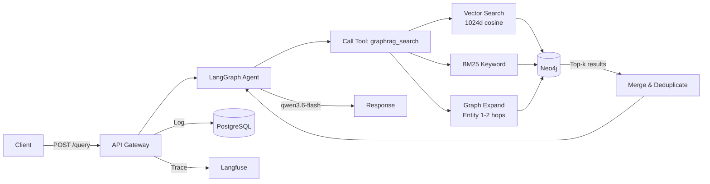
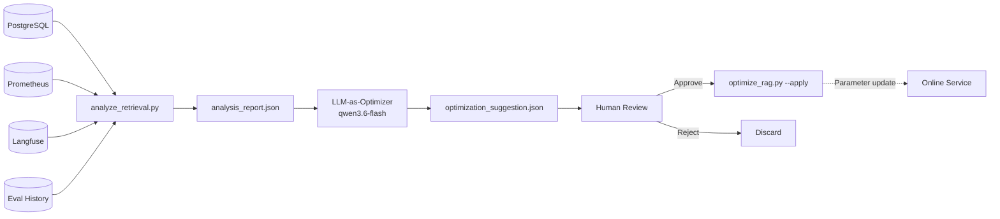

# NexusGraph

> Production-grade GraphRAG Demo with 3-path retrieval, offline evaluation, LLM-as-Judge, and automated optimization pipeline.

Built on RAGBench (TechQA) knowledge base (1,192 docs, 63,890 chunks). Graph DB: Neo4j 5. LLM: DashScope Qwen3.6-flash. Observability: Langfuse + Prometheus + Grafana.

---

## Architecture

### System Overview



### Online Query Flow



### Offline Data Flywheel



### Online System
- **FastAPI** server with LangGraph agent
- **3-path retrieval**: Vector (1024d cosine) + BM25 (fulltext) + Graph (entity expand, 1-2 hops)
- **Optional LLM reranker** (disabled by default)
- **Langfuse**: Full trace per query
- **Prometheus**: QPS, latency, DB connections
- **PostgreSQL**: RetrievalMetric + Feedback + EvalResult
- **Grafana**: 2 dashboards (System Overview + Retrieval Insights)

### Offline Pipeline (Data Flywheel)

Analysis report data sources:
| Source | Data |
|--------|------|
| PostgreSQL | Retrieval path contribution, feedback correlation |
| Prometheus | System QPS, latency, DB connections |
| Langfuse | LLM latency, token cost |
| Local JSON | Eval quality scores (last 5 runs) |

## Features

### 3-Path Retrieval
| Path | Method | Backend |
|------|--------|---------|
| Vector | Dense semantic search (1024d cosine) | Neo4j vector index |
| BM25 | Keyword / sparse search | Neo4j fulltext index (stop words filtered) |
| Graph | Entity-relation expansion | FROM_CHUNK + RELATES_TO (1-2 hops) |

### 7 Evaluation Metrics
| Metric | Range | Judge |
|--------|-------|-------|
| faithfulness | 0-1 | LLM-as-Judge (qwen-plus) |
| relevance | 0-1 | LLM-as-Judge |
| context_precision | 0-1 | LLM-as-Judge |
| answer_correctness | 0-1 | LLM-as-Judge vs ground truth |
| context_recall | 0-1 | Ground truth coverage |
| hit_rate | 0-1 | Rank-aware retrieval quality |
| avg_response_time_ms | - | Measured per sample |

### Knowledge Graph
- Entity extraction via neo4j-graphrag (qwen3.6-flash)
- Schema: Document -[:PART_OF]-> Chunk <-[:FROM_CHUNK]- Entity -[:RELATES_TO]-> Entity
- ~11,700 entities, ~9,800 typed relations across 50+ documents

### Data Flywheel
**Feedback loop**: User ratings (POST /feedback) are correlated with retrieval metrics in PostgreSQL. The analysis pipeline identifies patterns: which retrieval paths lead to low ratings, which parameter choices reduce faithfulness.

**Optimization rules**:
- faithfulness < 0.8 -> reduce top_k from 5 to 3
- context_precision < 0.7 -> reduce chunk_size to 256
- High latency -> reduce top_k or enable streaming
- BM25-only answers -> reduce vector weight threshold

### LLM-as-Optimizer
Reads the full analysis report and generates parameter change suggestions with:
- **Causal attribution**: Correlates Prometheus system metrics with eval quality scores
- **Trend analysis**: Compares last 5 evaluation runs
- **Tradeoff analysis**: Every suggestion includes expected impact on BOTH quality and performance
- **Human-in-the-loop**: Report must be approved before auto-deployment

### Observability
| Tool | Purpose | Data Retained | Access |
|------|---------|---------------|--------|
| Langfuse | LLM trace, latency, token cost | Cloud (persistent) | https://jp.cloud.langfuse.com |
| PostgreSQL | Retrieval metrics, eval results, feedback | Local (persistent volume) | port 5432 (127.0.0.1 only) |
| Prometheus | QPS, request latency, DB connections | TSDB (30-day retention) | port 9090 (127.0.0.1 only) |
| Grafana | Visual dashboard from Prometheus + PostgreSQL | - | port 3000 (admin/admin) |

**Grafana Dashboards**:
- **System Overview** (Prometheus): QPS by endpoint, request latency p95, DB connections, LLM inference duration, memory usage
- **Retrieval Insights** (PostgreSQL): Unique chunks/query, response time, eval score history, path contribution, overlap analysis, rating distribution, feedback correlation

## Quick Start

### Prerequisites
- Python 3.12+ (recommended: conda env)
- Docker and Docker Compose
- DashScope API Key (https://bailian.console.aliyun.com/)

### 1. Setup
```bash
git clone https://github.com/kanchengw/NexusGraph.git
cd NexusGraph
cp .env.example .env.development
# Edit .env.development -- fill in your DashScope API key
```

### 2. Start Infrastructure
```bash
# Data layer only (Neo4j + PostgreSQL)
docker compose --profile offline up -d

# Or full stack (+ app + Prometheus + Grafana + cAdvisor)
docker compose --profile online up -d
```

### 3. Index Knowledge Base
```bash
conda activate newML
pip install -e .
python scripts/ingest_knowledge_base.py
python scripts/extract_entities.py --max-docs 50
```

### 4. Query
```bash
# Start server
conda run -n newML python run_server.py

# In another terminal:
curl -X POST http://localhost:8000/api/v1/graphrag/query \
  -H "Content-Type: application/json" \
  -d '{"question":"What is IBM WebSphere?","top_k":5}'
```

### 5. Offline Evaluation
```bash
# Full pipeline: eval -> analyze -> optimize -> report
conda run -n newML python -m offline_agent.cli pipeline

# Or step by step:
conda run -n newML python -m evals.evaluate_graphrag     # Run RAGBench eval
conda run -n newML python scripts/analyze_retrieval.py    # Generate analysis report
conda run -n newML python scripts/optimize_rag.py         # LLM generates suggestions
```

### 6. Apply Optimization (Human-in-the-loop)
```bash
# Review the suggestion report at evals/reports/optimization_suggestion.json
# Then approve:
python scripts/optimize_rag.py --apply
```

## Production Deployment

### Docker Compose (Production)

```bash
# 1. Configure production environment
cp .env.production .env.production
# Edit .env.production with your credentials

# 2. Start with production profile
docker compose --profile online --env-file .env.production up -d
```

Production docker-compose features:
| Feature | Implementation |
|---------|---------------|
| Data persistence | Named volumes (neo4j_data, postgres_data, prometheus_data) |
| Resource limits | Memory caps: app 4G, neo4j 2G, pg 1G, prometheus 1G, grafana 512M |
| Self-healing | restart: unless-stopped on all 6 services |
| Health checks | App: curl /health (30s interval, 60s startup grace) |
| Security | Internal ports bound to 127.0.0.1 (5432, 7687, 9090, 8080) |
| Metrics | cAdvisor for container-level resource monitoring |
| Password management | All passwords via env vars with defaults in .env.production |

### Data Backup & Restore

```bash
# Backup Neo4j + PostgreSQL + configs
bash scripts/backup-data.sh

# Restore from a backup archive
bash scripts/restore-data.sh backups/nexusgraph-backup-20260629_120000.tar.gz
```

### Port Map
| Port | Service | Public | Purpose |
|------|---------|--------|---------|
| 8000 | FastAPI app | Yes | API endpoint |
| 3000 | Grafana | Yes | Dashboard UI |
| 5432 | PostgreSQL | No (127.0.0.1) | Internal DB |
| 7687 | Neo4j Bolt | No (127.0.0.1) | Graph DB |
| 9090 | Prometheus | No (127.0.0.1) | Metrics TSDB |
| 8080 | cAdvisor | No (127.0.0.1) | Container metrics |

## API Endpoints

| Method | Path | Description |
|--------|------|-------------|
| POST | /api/v1/graphrag/query | 3-path retrieval query (with optional LLM reranker) |
| GET | /api/v1/graphrag/health | Service health + Neo4j node count |
| POST | /api/v1/graphrag/clear | Clear knowledge graph |
| POST | /api/v1/graphrag/feedback | Submit feedback for flywheel |

## Configuration

### Required (.env.development)
| Variable | Default | Description |
|----------|---------|-------------|
| LLM_BASE_URL | https://dashscope.aliyuncs.com/compatible-mode/v1 | DashScope endpoint |
| LLM_API_KEY | - | DashScope API key |
| DEFAULT_LLM_MODEL | qwen3.6-flash | Online LLM |
| EMBEDDING_MODEL | text-embedding-v3 | Embedding (1024d) |
| LANGFUSE_PUBLIC_KEY / SECRET_KEY | - | Langfuse credentials |

### Optional
| Variable | Default | Description |
|----------|---------|-------------|
| GRAPHRAG_ENABLE_RERANKER | false | Enable LLM reranker after 3-path retrieval |
| GRAPHRAG_CHUNK_SIZE | 512 | Chunk size (chars) |
| GRAPHRAG_CHUNK_OVERLAP | 64 | Chunk overlap |
| GRAPHRAG_TOP_K | 5 | Top chunks per path |
| EVALUATION_LLM | qwen-plus | Judge model |

## Project Structure
```
NexusGraph/
|-- app/api/v1/graphrag/     # REST endpoints
|-- app/core/graphrag/       # Indexer, Retriever, Neo4j models
|-- app/core/langgraph/      # Agent graph + tools
|-- app/models/              # SQLModel tables (RetrievalMetric, EvalResult, Feedback)
|-- app/services/            # LLM registry, embeddings, database
|-- evals/                   # RAGBench evaluation pipeline (7 metrics)
|-- offline_agent/           # CLI: eval / analyze / optimize pipeline
|-- scripts/                 # ingest, extract, analyze, optimize, backup, restore
|-- tests/                   # 47 tests
|-- grafana/                 # Grafana dashboard provisioning (2 dashboards)
|-- prometheus/              # Prometheus config + scrape targets
|-- docker-compose.yml       # Production-ready (volumes, limits, healthchecks)
```

## Test Status
```bash
pytest tests/ -v
# 47 passed, 2 skipped, 0 failed
```

## License
Apache 2.0 - Copyright 2026 kanchengw
## Quick Start

### Prerequisites
- Python 3.12+ (recommended: conda env)
- Docker and Docker Compose
- DashScope API Key (https://bailian.console.aliyun.com/)

### 1. Setup
```bash
git clone https://github.com/kanchengw/NexusGraph.git
cd NexusGraph
cp .env.example .env.development
# Edit .env.development -- fill in your DashScope API key
```

### 2. Start Infrastructure
```bash
docker compose --profile offline up -d
# Or full stack (+ app + Prometheus + Grafana):
docker compose --profile online up -d
```

### 3. Start API Server
```bash
conda run -n newML python run_server.py
```

### 4. Start Web UI (Streamlit)
```bash
conda run -n newML pip install streamlit
conda run -n newML streamlit run ui/app.py
```
Open http://localhost:8501

### 5. Index Knowledge Base
```bash
python scripts/ingest_knowledge_base.py
python scripts/extract_entities.py --max-docs 50
```

### 6. Query via API
```bash
curl -X POST http://localhost:8000/api/v1/graphrag/query \
  -H "Content-Type: application/json" \
  -d '{"question":"How to fix WebSphere DataPower XC10 appliance error","top_k":5}'
```

### Offline Pipeline (Data Flywheel)

Analysis report data sources:eval, offline evaluation, LLM-as-Judge, and automated optimization pipeline.

Built on RAGBench (TechQA) knowledge base (1,192 docs, 63,890 chunks). Graph DB: Neo4j 5. LLM: DashScope Qwen3.6-flash. Observability: Langfuse + Prometheus + Grafana.

---

## Architecture

### System Overview


### Online Query Flow


### Offline Data Flywheel


### Online System
- **FastAPI** server with LangGraph agent
- **3-path retrieval**: Vector (1024d cosine) + BM25 (fulltext) + Graph (entity expand, 1-2 hops)
- **Optional LLM reranker** (disabled by default)
- **Langfuse**: Full trace per query
- **Prometheus**: QPS, latency, DB connections
- **PostgreSQL**: RetrievalMetric + Feedback + EvalResult
- **Grafana**: 2 dashboards (System Overview + Retrieval Insights)

### Offline Pipeline (Data Flywheel)

Analysis report data sources:
| Source | Data |
|--------|------|
| PostgreSQL | Retrieval path contribution, feedback correlation |
| Prometheus | System QPS, latency, DB connections |
| Langfuse | LLM latency, token cost |
| Local JSON | Eval quality scores (last 5 runs) |

## Features

### 3-Path Retrieval
| Path | Method | Backend |
|------|--------|---------|
| Vector | Dense semantic search (1024d cosine) | Neo4j vector index |
| BM25 | Keyword / sparse search | Neo4j fulltext index (stop words filtered) |
| Graph | Entity-relation expansion | FROM_CHUNK + RELATES_TO (1-2 hops) |

### 7 Evaluation Metrics
| Metric | Range | Judge |
|--------|-------|-------|
| faithfulness | 0-1 | LLM-as-Judge (qwen-plus) |
| relevance | 0-1 | LLM-as-Judge |
| context_precision | 0-1 | LLM-as-Judge |
| answer_correctness | 0-1 | LLM-as-Judge vs ground truth |
| context_recall | 0-1 | Ground truth coverage |
| hit_rate | 0-1 | Rank-aware retrieval quality |
| avg_response_time_ms | - | Measured per sample |

### Knowledge Graph
- Entity extraction via neo4j-graphrag (qwen3.6-flash)
- Schema: Document -[:PART_OF]-> Chunk <-[:FROM_CHUNK]- Entity -[:RELATES_TO]-> Entity
- ~11,700 entities, ~9,800 typed relations across 50+ documents

### Data Flywheel
**Feedback loop**: User ratings (POST /feedback) are correlated with retrieval metrics in PostgreSQL. The analysis pipeline identifies patterns: which retrieval paths lead to low ratings, which parameter choices reduce faithfulness.

**Optimization rules**:
- faithfulness < 0.8 -> reduce top_k from 5 to 3
- context_precision < 0.7 -> reduce chunk_size to 256
- High latency -> reduce top_k or enable streaming
- BM25-only answers -> reduce vector weight threshold

### LLM-as-Optimizer
Reads the full analysis report and generates parameter change suggestions with:
- **Causal attribution**: Correlates Prometheus system metrics with eval quality scores
- **Trend analysis**: Compares last 5 evaluation runs
- **Tradeoff analysis**: Every suggestion includes expected impact on BOTH quality and performance
- **Human-in-the-loop**: Report must be approved before auto-deployment

### Observability
| Tool | Purpose | Data Retained | Access |
|------|---------|---------------|--------|
| Langfuse | LLM trace, latency, token cost | Cloud (persistent) | https://jp.cloud.langfuse.com |
| PostgreSQL | Retrieval metrics, eval results, feedback | Local (persistent volume) | port 5432 (127.0.0.1 only) |
| Prometheus | QPS, request latency, DB connections | TSDB (30-day retention) | port 9090 (127.0.0.1 only) |
| Grafana | Visual dashboard from Prometheus + PostgreSQL | - | port 3000 (admin/admin) |

**Grafana Dashboards**:
- **System Overview** (Prometheus): QPS by endpoint, request latency p95, DB connections, LLM inference duration, memory usage
- **Retrieval Insights** (PostgreSQL): Unique chunks/query, response time, eval score history, path contribution, overlap analysis, rating distribution, feedback correlation

## Quick Start

### Prerequisites
- Python 3.12+ (recommended: conda env)
- Docker and Docker Compose
- DashScope API Key (https://bailian.console.aliyun.com/)

### 1. Setup
```bash
git clone https://github.com/kanchengw/NexusGraph.git
cd NexusGraph
cp .env.example .env.development
# Edit .env.development -- fill in your DashScope API key
```

### 2. Start Infrastructure
```bash
# Data layer only (Neo4j + PostgreSQL)
docker compose --profile offline up -d

# Or full stack (+ app + Prometheus + Grafana + cAdvisor)
docker compose --profile online up -d
```

### 3. Index Knowledge Base
```bash
conda activate newML
pip install -e .
python scripts/ingest_knowledge_base.py
python scripts/extract_entities.py --max-docs 50
```

### 4. Query
```bash
# Start server
conda run -n newML python run_server.py

# In another terminal:
curl -X POST http://localhost:8000/api/v1/graphrag/query \
  -H "Content-Type: application/json" \
  -d '{"question":"What is IBM WebSphere?","top_k":5}'
```

### 5. Offline Evaluation
```bash
# Full pipeline: eval -> analyze -> optimize -> report
conda run -n newML python -m offline_agent.cli pipeline

# Or step by step:
conda run -n newML python -m evals.evaluate_graphrag     # Run RAGBench eval
conda run -n newML python scripts/analyze_retrieval.py    # Generate analysis report
conda run -n newML python scripts/optimize_rag.py         # LLM generates suggestions
```

### 6. Apply Optimization (Human-in-the-loop)
```bash
# Review the suggestion report at evals/reports/optimization_suggestion.json
# Then approve:
python scripts/optimize_rag.py --apply
```

## Production Deployment

### Docker Compose (Production)

```bash
# 1. Configure production environment
cp .env.production .env.production
# Edit .env.production with your credentials

# 2. Start with production profile
docker compose --profile online --env-file .env.production up -d
```

Production docker-compose features:
| Feature | Implementation |
|---------|---------------|
| Data persistence | Named volumes (neo4j_data, postgres_data, prometheus_data) |
| Resource limits | Memory caps: app 4G, neo4j 2G, pg 1G, prometheus 1G, grafana 512M |
| Self-healing | restart: unless-stopped on all 6 services |
| Health checks | App: curl /health (30s interval, 60s startup grace) |
| Security | Internal ports bound to 127.0.0.1 (5432, 7687, 9090, 8080) |
| Metrics | cAdvisor for container-level resource monitoring |
| Password management | All passwords via env vars with defaults in .env.production |

### Data Backup & Restore

```bash
# Backup Neo4j + PostgreSQL + configs
bash scripts/backup-data.sh

# Restore from a backup archive
bash scripts/restore-data.sh backups/nexusgraph-backup-20260629_120000.tar.gz
```

### Port Map
| Port | Service | Public | Purpose |
|------|---------|--------|---------|
| 8000 | FastAPI app | Yes | API endpoint |
| 3000 | Grafana | Yes | Dashboard UI |
| 5432 | PostgreSQL | No (127.0.0.1) | Internal DB |
| 7687 | Neo4j Bolt | No (127.0.0.1) | Graph DB |
| 9090 | Prometheus | No (127.0.0.1) | Metrics TSDB |
| 8080 | cAdvisor | No (127.0.0.1) | Container metrics |

## API Endpoints

| Method | Path | Description |
|--------|------|-------------|
| POST | /api/v1/graphrag/query | 3-path retrieval query (with optional LLM reranker) |
| GET | /api/v1/graphrag/health | Service health + Neo4j node count |
| POST | /api/v1/graphrag/clear | Clear knowledge graph |
| POST | /api/v1/graphrag/feedback | Submit feedback for flywheel |

## Configuration

### Required (.env.development)
| Variable | Default | Description |
|----------|---------|-------------|
| LLM_BASE_URL | https://dashscope.aliyuncs.com/compatible-mode/v1 | DashScope endpoint |
| LLM_API_KEY | - | DashScope API key |
| DEFAULT_LLM_MODEL | qwen3.6-flash | Online LLM |
| EMBEDDING_MODEL | text-embedding-v3 | Embedding (1024d) |
| LANGFUSE_PUBLIC_KEY / SECRET_KEY | - | Langfuse credentials |

### Optional
| Variable | Default | Description |
|----------|---------|-------------|
| GRAPHRAG_ENABLE_RERANKER | false | Enable LLM reranker after 3-path retrieval |
| GRAPHRAG_CHUNK_SIZE | 512 | Chunk size (chars) |
| GRAPHRAG_CHUNK_OVERLAP | 64 | Chunk overlap |
| GRAPHRAG_TOP_K | 5 | Top chunks per path |
| EVALUATION_LLM | qwen-plus | Judge model |

## Project Structure
```
NexusGraph/
|-- app/api/v1/graphrag/     # REST endpoints
|-- app/core/graphrag/       # Indexer, Retriever, Neo4j models
|-- app/core/langgraph/      # Agent graph + tools
|-- app/models/              # SQLModel tables (RetrievalMetric, EvalResult, Feedback)
|-- app/services/            # LLM registry, embeddings, database
|-- evals/                   # RAGBench evaluation pipeline (7 metrics)
|-- offline_agent/           # CLI: eval / analyze / optimize pipeline
|-- scripts/                 # ingest, extract, analyze, optimize, backup, restore
|-- tests/                   # 47 tests
|-- grafana/                 # Grafana dashboard provisioning (2 dashboards)
|-- prometheus/              # Prometheus config + scrape targets
|-- docker-compose.yml       # Production-ready (volumes, limits, healthchecks)
```

## Test Status
```bash
pytest tests/ -v
# 47 passed, 2 skipped, 0 failed
```

## License
Apache 2.0 - Copyright 2026 kanchengw
