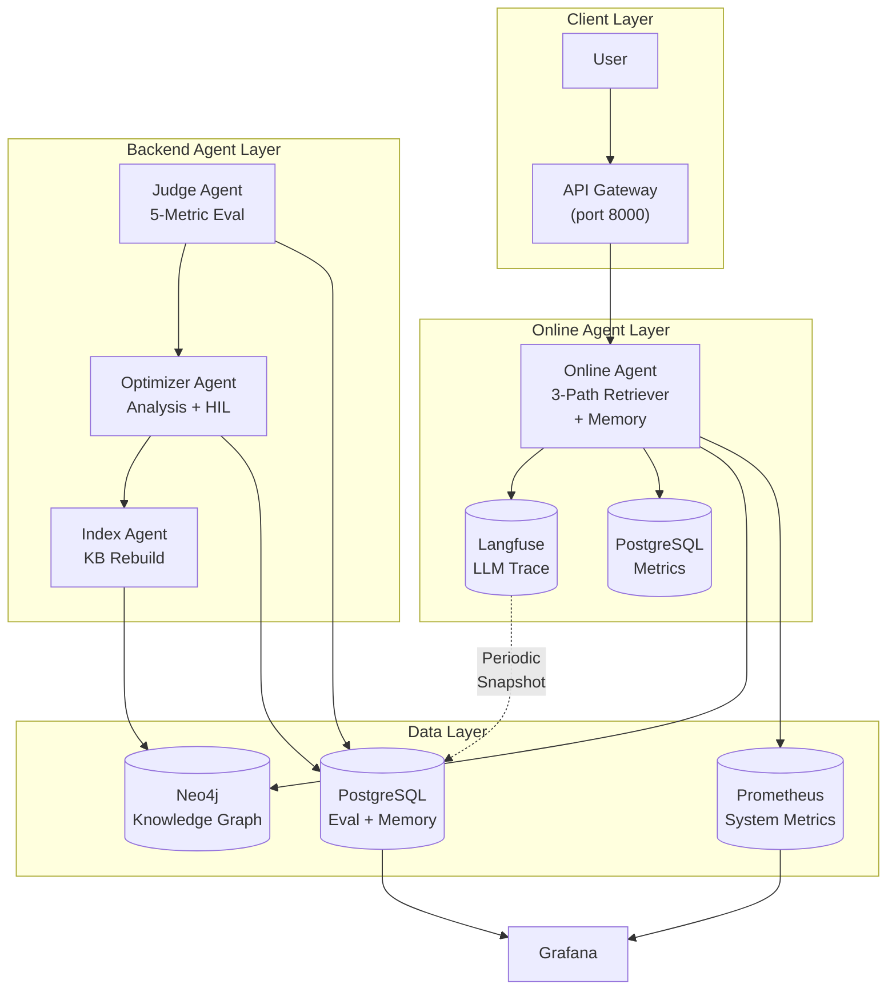
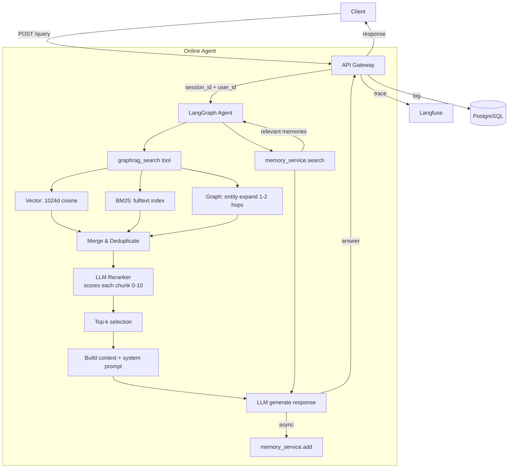
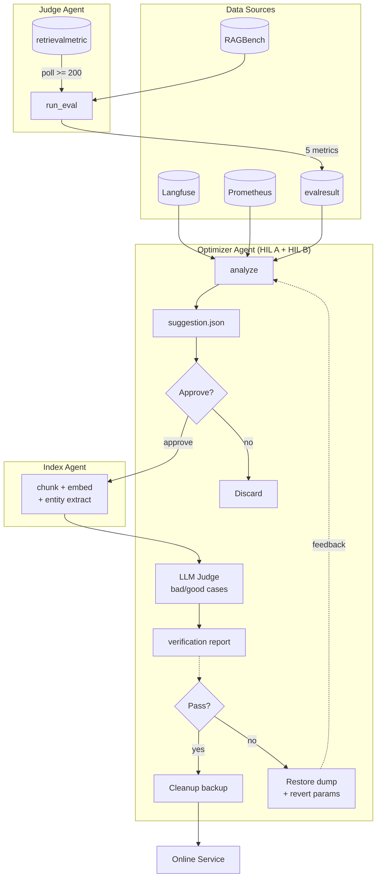

# NexusGraph

> Production-grade GraphRAG Demo with 3-path retrieval, LLM reranker, 5-metric LLM-as-Judge, dual-layer memory, HIL approval, and automated data flywheel.

Built on RAGBench (TechQA) knowledge base (1,192 docs, 63,890 chunks). Graph DB: Neo4j 5. LLM: DashScope Qwen3.6-flash. Observability: Langfuse + Prometheus + Grafana.

***

## Architecture

### System Architecture



### Online Query Flow



### Backend Data Flywheel



## Project Structure

```
NexusGraph/
+-- app/core/
|   +-- langgraph/          # Online Agent (graph + tools)
|   +-- graphrag/           # Retriever, Indexer
|   +-- judge_agent/        # Evaluation pipeline
|   +-- optimizer_agent/    # Analysis + LLM opt + HIL
|   +-- index_agent/        # KB construction
+-- app/api/                # REST endpoints
+-- app/models/             # SQLModel
+-- app/services/           # LLM, embeddings, memory
+-- offline_agent/          # CLI entry point
+-- scripts/                # Utility scripts
+-- grafana/                # Dashboard provisioning
+-- prometheus/             # Config
+-- docker-compose.yml      # Docker profiles
```

## Features

### Base Services (always-on infrastructure)

- **PostgreSQL** (pgvector): RetrievalMetric, Feedback, EvalResult, Memory vectors
- **Prometheus + Grafana**: QPS, latency, container metrics, 2 dashboards
- **cAdvisor**: Container resource usage

### Online Agent

- **FastAPI** server with LangGraph agent
- **Two-layer memory**: Short-term (session checkpoints) + Long-term (mem0 + pgvector cross-session)
- **3-path retrieval + LLM reranker**: Vector (1024d cosine) + BM25 (fulltext) + Graph (entity expand, 1-2 hops) + LLM rerank (always on)
- **Langfuse**: Full trace per query

### Backend Agents

| Agent               | Directory                  | Responsibility                                                                   |
| ------------------- | -------------------------- | -------------------------------------------------------------------------------- |
| **Judge Agent**     | app/core/judge\_agent/     | RAGBench evaluation, triggered by conversation count (default 200, configurable) |
| **Optimizer Agent** | app/core/optimizer\_agent/ | Metrics analysis + LLM optimization + HIL approval                               |
| **Index Agent**     | app/core/index\_agent/     | KB construction (chunk, embed, entity extract)                                   |

Data flywheel: Judge (triggered by conversation count) -> Optimizer (HIL) -> Index, automated via workflow.

### Local Mode (Index Agent Only)

ENABLE\_LOCAL=true replaces cloud API calls **only for the Index Agent** (knowledge base construction). Online Agent always uses cloud DashScope.

| Component                     | Cloud (default)             | Local (ENABLE\_LOCAL=true)                   |
| ----------------------------- | --------------------------- | -------------------------------------------- |
| Index Agent Embedding         | DashScope text-embedding-v3 | mxbai-embed-large-v1 (sentence-transformers) |
| Index Agent Entity Extraction | DashScope qwen3.6-flash     | deepseek-r1:8b (Ollama)                      |

```bash
# .env.development
ENABLE_LOCAL=true
LOCAL_OLLAMA_BASE_URL=http://127.0.0.1:11434/v1
LOCAL_LLM_MODEL=deepseek-r1:8b
```

## Quick Start

### Prerequisites

- Python 3.12+
- Docker and Docker Compose
- LLM API key (DashScope)

### Setup

```bash
git clone https://github.com/kanchengw/NexusGraph.git
cd NexusGraph
cp .env.example .env.development
# Configure your LLM API key and backend
```

### 1. Start Infrastructure (Docker)

```bash
# Full online serving
docker compose --profile online --env-file .env.production up -d

# Data layer + monitoring for offline analysis
docker compose --profile offline up -d

# Monitoring only
docker compose --profile base up -d
```

### 2. Start Application

```bash
# Online API + Chat UI (port 8000)
python run_server.py
```

### Index Knowledge Base

Choose one of two approaches:

**Option A — Download pre-built release (recommended)**
Download from GitHub Releases — contains a fully built Neo4j graph database with TechQA demo data.

```bash
docker compose --profile offline up -d neo4j
docker cp backups/neo4j.dump graphrag-neo4j:/data/
docker exec graphrag-neo4j neo4j-admin database load --from-path=/data/neo4j.dump --overwrite-destination=true
docker restart graphrag-neo4j
```

| Artifact      | Count  | Description                                                           |
| ------------- | ------ | --------------------------------------------------------------------- |
| Documents     | 1,192  | TechQA train split                                                    |
| Chunks        | 63,890 | 512-char chunks, 64-char overlap                                      |
| Entity Nodes  | \~8K+  | Extracted from \~50 docs (deepseek-r1:8b local / qwen3.6-flash cloud) |
| Relationships | \~15K+ | Entity relations from \~50 docs                                       |

**Option B — Build from scratch**

```bash
python scripts/run_index_agent.py --split train
```

> **Note**: With ENABLE\_LOCAL=true, entity extraction uses local deepseek-r1:8b (no API key needed). Building full index takes \~30 min (cloud) or \~2-3 hr (local).

### Run Offline Pipeline

```bash
python -m offline_agent.cli --help
# Subcommands: eval, analyze, optimize, index, flywheel
```

## Production Deployment

### Docker Compose Profiles

| Profile     | Services                                                             | Use Case                                     |
| ----------- | -------------------------------------------------------------------- | -------------------------------------------- |
| **online**  | PostgreSQL + Neo4j + Prometheus + Grafana + cAdvisor + App (FastAPI) | Full stack online serving                    |
| **offline** | PostgreSQL + Neo4j + Prometheus + Grafana + cAdvisor                 | Data layer + monitoring for offline analysis |
| **base**    | Prometheus + Grafana + cAdvisor                                      | Monitoring infrastructure only               |

### Port Map

| Port | Service       | Public | Purpose              |
| ---- | ------------- | ------ | -------------------- |
| 8000 | FastAPI + UI  | Yes    | Online API + Chat UI |
| 3000 | Grafana       | Yes    | Dashboard UI         |
| 5432 | PostgreSQL    | No     | Internal DB          |
| 7474 | Neo4j Browser | No     | Graph management     |
| 7687 | Neo4j Bolt    | No     | Graph DB             |
| 9090 | Prometheus    | No     | Metrics              |
| 8080 | cAdvisor      | No     | Container metrics    |

### Data Persistence

| Volume           | Service    | Purpose                         |
| ---------------- | ---------- | ------------------------------- |
| neo4j\_data      | Neo4j      | Graph database                  |
| postgres\_data   | PostgreSQL | Metrics, feedback, eval, memory |
| prometheus\_data | Prometheus | Time-series metrics             |
| grafana\_data    | Grafana    | Dashboard settings              |

### Backup & Restore

```bash
bash scripts/backup-data.sh
bash scripts/restore-data.sh <backup.tar.gz>
```

## Configuration

### Required (.env.development)

| Variable            | Description      |
| ------------------- | ---------------- |
| LLM\_BASE\_URL      | LLM API endpoint |
| LLM\_API\_KEY       | LLM API key      |
| DEFAULT\_LLM\_MODEL | Online LLM model |
| EMBEDDING\_MODEL    | Embedding model  |

### Optional

| Variable                   | Default                      | Description                |
| -------------------------- | ---------------------------- | -------------------------- |
| GRAPHRAG\_CHUNK\_SIZE      | 512                          | Chunk size (chars)         |
| GRAPHRAG\_CHUNK\_OVERLAP   | 64                           | Chunk overlap              |
| GRAPHRAG\_TOP\_K           | 5                            | Top chunks per path        |
| GRAPHRAG\_ENABLE\_RERANKER | true                         | LLM reranker               |
| EVALUATION\_LLM            | qwen-plus                    | Judge model for eval       |
| EVALUATION\_API\_KEY       | (same as LLM)                | Separate API key for eval  |
| EVALUATION\_BASE\_URL      | (same as LLM)                | Separate endpoint for eval |
| LANGFUSE\_PUBLIC\_KEY      | -                            | Langfuse public key        |
| LANGFUSE\_SECRET\_KEY      | -                            | Langfuse secret key        |
| LANGFUSE\_HOST             | <https://cloud.langfuse.com> | Langfuse endpoint          |

## API Endpoints

| Method | Path                            | Description     |
| ------ | ------------------------------- | --------------- |
| POST   | /api/v1/graphrag/query          | Retrieval query |
| GET    | /api/v1/graphrag/health         | Service health  |
| POST   | /api/v1/graphrag/feedback       | Submit feedback |
| GET    | /api/v1/graphrag/feedback/stats | Feedback stats  |

## License

Apache 2.0 — Copyright 2026 kanchengw
